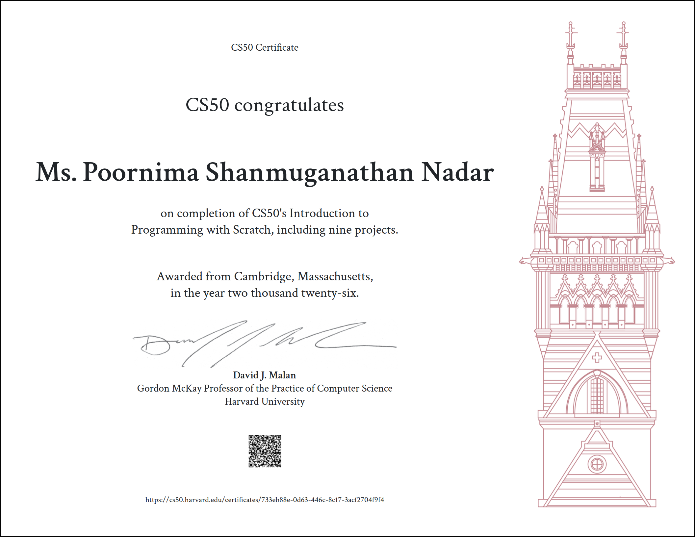

# CS50 Scratch

This repository contains the projects I completed as part of Harvard University's CS50 Scratch course.

Through these projects, I explored the fundamentals of programming and computational thinking using Scratch, including sprites, events, functions, values, conditions, loops, variables, abstraction, and building complete interactive projects.

## Projects

| Project   | Topic                 |
| --------- | --------------------- |
| Project 1 | Sprites               |
| Project 2 | Functions             |
| Project 3 | Events                |
| Project 4 | Values                |
| Project 5 | Conditions            |
| Project 6 | Loops                 |
| Project 7 | Variables             |
| Project 8 | Abstraction           |
| Project 9 | Building from Scratch |

## Certificate

## About

This repository serves as a record of my learning journey through CS50 Scratch and the projects developed throughout the course.

**Author:** Poornima Shaja
